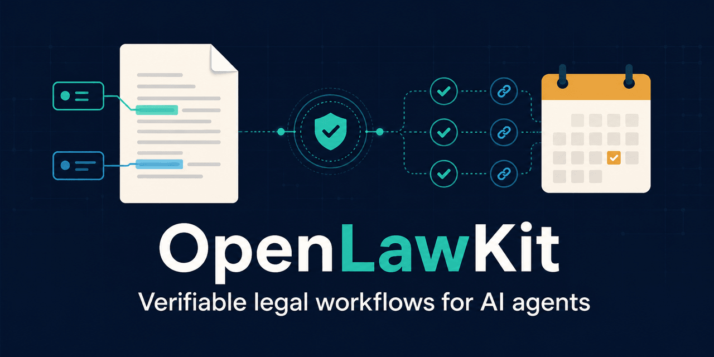
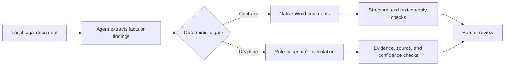

# OpenLawKit



Privacy-first, testable legal workflows for AI coding agents. Local by default, evidence-linked, and human-reviewable.

> **Early preview:** v0.1 focuses on two narrow workflows: Word contract review with native comments, and evidence-linked legal deadline extraction. It is not a lawyer replacement and does not provide unattended legal advice.

[简体中文](README.zh-CN.md)

## Why this project

Most legal-agent demos stop at fluent text. OpenLawKit treats the output as something that must be inspected and verified:

- source documents stay local unless the user explicitly chooses otherwise;
- every deadline keeps the triggering text and calculation basis;
- contract review adds native Word comments without rewriting the contract body;
- missing facts become explicit review items, never invented answers;
- fictional fixtures and regression tests are included.



## Skills

| Skill | Input | Output | Safety invariant |
|---|---|---|---|
| `contract-comment-review` | `.docx` contract + review stance | Reviewed `.docx` with native comments + finding ledger | Original contract text remains unchanged |
| `legal-deadline-extractor` | Legal document or extracted facts | Deadline table with evidence, basis, and confidence | No exact deadline without a verified trigger date and rule |

## Quick start

Each skill is self-contained under `skills/`. Open its `SKILL.md` with your agent and follow the workflow. The sample files under `examples/` are entirely fictional.

See [Architecture](docs/architecture.md) for the trust boundaries and validation gates.

Run the deterministic part of both fictional demos from the repository root:

```powershell
python skills/contract-comment-review/scripts/add_comments.py `
  examples/contract-review/fictional-service-contract.docx `
  examples/contract-review/fictional-findings.json `
  -o demo-output/reviewed.docx

python skills/contract-comment-review/scripts/verify_comments.py `
  examples/contract-review/fictional-service-contract.docx `
  demo-output/reviewed.docx `
  examples/contract-review/fictional-findings.json `
  --report demo-output/contract-verification.json

python skills/legal-deadline-extractor/scripts/calculate_deadlines.py `
  examples/deadline-extractor/fictional-labor-facts.json `
  --rules skills/legal-deadline-extractor/references/rules.json `
  --holidays skills/legal-deadline-extractor/references/holidays-cn-2026.json `
  --output-dir demo-output/deadlines
```

These commands replay reviewed facts/findings. The agent workflow that creates those intermediate files is defined in each `SKILL.md`.

## Scope and limitations

The initial legal rule pack is limited to explicitly listed PRC labor-arbitration and civil-enforcement events. Rules may change and local practice may differ. Always verify the source document, current law, service date, local holiday calendar, and procedural posture before relying on an output.

The current inclusion and exclusion list, with official primary sources, is documented in [the v0.1 rule-scope note](docs/rule-scope.zh-CN.md).

## Security

Do not submit client names, case numbers, account credentials, internal paths, or live matter files to public issues. See [SECURITY.md](SECURITY.md).

## License

Apache License 2.0. See [LICENSE](LICENSE) and [NOTICE](NOTICE).
