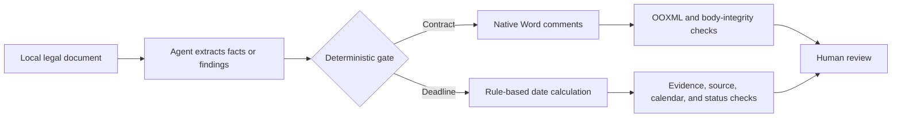

[English](README.md) | [简体中文](README.zh-CN.md)

# OpenLawKit

[](https://github.com/qwertyzhu/openlawkit/actions/workflows/ci.yml)
[](https://github.com/qwertyzhu/openlawkit/releases/latest)
[](LICENSE)
[](pyproject.toml)

**Local-first Agent Skills for PRC legal work: add native Word comments without changing contract text, and calculate legal deadlines only from verified trigger facts.**

Built for lawyers and legal-AI developers using coding agents. OpenLawKit is deliberately narrow, auditable, and human-reviewable—not a general legal chatbot.

[Run the fictional demo](#run-the-repository-demo) · [Download the Word review Skill](https://github.com/qwertyzhu/openlawkit/releases/latest/download/contract-comment-review.skill) · [Download the deadline Skill](https://github.com/qwertyzhu/openlawkit/releases/latest/download/legal-deadline-extractor.skill) · [View v0.1.0](https://github.com/qwertyzhu/openlawkit/releases/tag/v0.1.0)

> **Early preview:** the first release covers two PRC workflows. It does not replace a lawyer or provide unattended legal advice.

## See the output first

Native Word comments anchored to exact contract text. The fictional contract body remains unchanged.


An evidence-linked deadline record that preserves the trigger text, location, rule, official basis, and calculation status.


Both images come from the fictional fixtures in this repository. CI replays the deterministic workflows and integrity checks on Linux and Windows.

## Install the Skills

### Codex

Paste this into Codex:

```text
$skill-installer
Install both skills from qwertyzhu/openlawkit:
- skills/contract-comment-review
- skills/legal-deadline-extractor
```

This follows the [official Codex Skill installation model](https://learn.chatgpt.com/docs/build-skills). Restart Codex after installation so it discovers the new Skills.

### Claude Code

Copy the two directories under `skills/` into `~/.claude/skills/` for personal use or `.claude/skills/` for one project. This is the filesystem layout documented in [Anthropic's Agent Skills guide](https://platform.claude.com/docs/en/agents-and-tools/agent-skills/overview).

The `.skill` archives contain instructions, scripts, schemas, and references; they do not bundle Python itself. The deterministic scripts require Python 3.10+ plus `lxml` and `python-docx`. The repository demo below installs those dependencies reproducibly.

Release files: [contract-comment-review.skill](https://github.com/qwertyzhu/openlawkit/releases/latest/download/contract-comment-review.skill) · [legal-deadline-extractor.skill](https://github.com/qwertyzhu/openlawkit/releases/latest/download/legal-deadline-extractor.skill) · [SHA256SUMS.txt](https://github.com/qwertyzhu/openlawkit/releases/latest/download/SHA256SUMS.txt)

## Run the repository demo

The shortest cross-platform path is:

```console
git clone https://github.com/qwertyzhu/openlawkit.git
cd openlawkit
python -m pip install -e .
python scripts/run_demo.py --clean
```

Expected outputs:

- `demo-output/reviewed.docx` — native Word comments on a fictional contract;
- `demo-output/contract-verification.json` — comment structure and body-integrity verification;
- `demo-output/deadlines/` — JSON, Markdown, and ICS deadline outputs;
- the labor-arbitration fixture produces a confirmed `2026-06-23` date from an explicit fictional service record.

The demo replays already reviewed facts and findings. The agent workflow that creates those intermediate files is defined in each `SKILL.md`.

## Two focused workflows

| Skill | Input | Output | Safety invariant |
|---|---|---|---|
| [`contract-comment-review`](skills/contract-comment-review/SKILL.md) | `.docx` contract + represented party | Reviewed `.docx` with native comments + finding ledger | No silent mutation of contract-body text |
| [`legal-deadline-extractor`](skills/legal-deadline-extractor/SKILL.md) | Legal document or extracted facts | Deadline table with evidence, rule, and status | No exact deadline without a verified trigger and rule |

Starter prompts:

```text
Review this Word contract from the buyer's position. Add native comments only, keep the body text unchanged, and return the verification report.
```

```text
Extract auditable deadlines from this document. Preserve every trigger excerpt and location. If the service date or procedural type is missing, return needs_confirmation instead of guessing.
```

## Why the outputs are auditable



- Documents stay local unless the user explicitly chooses otherwise.
- Every deadline keeps the original trigger excerpt and source locator.
- Missing facts become review items, not invented answers.
- Legal rules live in a versioned data pack with official primary sources and verification dates.
- Fictional fixtures and regression tests make failures reproducible.

See [Architecture](docs/architecture.md) for the trust boundaries and validation gates.

## Compatibility and limits

| Area | Current support |
|---|---|
| Runtime | Python 3.10+; CI on Ubuntu and Windows with Python 3.12 |
| Word review | `.docx` main-body paragraph anchors; visually opened in Microsoft Word for Windows |
| Unsupported Word comment anchors | Tables, headers/footers, text boxes, hyperlinks/fields, revision containers, and overlapping anchors are rejected in v0.1; text inside body tables is still covered by integrity verification |
| Deadline rules | The events explicitly listed in the PRC labor-arbitration and civil-enforcement v0.1 rule pack |
| Calendar | The included official 2026 PRC holiday-adjustment calendar; other years require another verified calendar |
| Legal judgment | Human review is always required; structural verification is not proof that legal advice is correct |

The exact included and excluded deadline rules, with official sources, are in the [v0.1 rule-scope note](docs/rule-scope.zh-CN.md).

## Roadmap and community

The next useful milestones are broader real-world fixture coverage, verified cross-platform onboarding, safe rule contributions, and support for additional Word structures without weakening text-integrity checks.

- Ask questions or show a safe demo in [Discussions](https://github.com/qwertyzhu/openlawkit/discussions).
- Pick a scoped contribution from [`good first issue`](https://github.com/qwertyzhu/openlawkit/labels/good%20first%20issue).
- Read [CONTRIBUTING.md](CONTRIBUTING.md) before proposing a rule or workflow change.

## Security

Do not put client names, case numbers, credentials, internal paths, or live matter files in a public issue. Use [private vulnerability reporting](https://github.com/qwertyzhu/openlawkit/security/advisories/new) for security or accidental-disclosure reports. See [SECURITY.md](SECURITY.md).

## License

Apache License 2.0. See [LICENSE](LICENSE) and [NOTICE](NOTICE).
