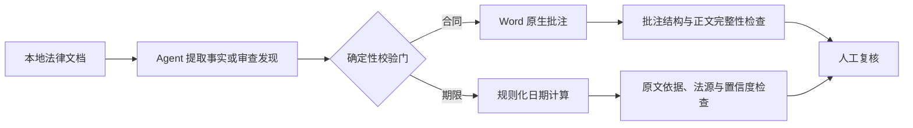

# OpenLawKit


面向 AI 编程 Agent 的隐私优先、可测试法律工作流：默认本地处理，结论可追溯，并保留人工复核入口。

> **早期预览版：** v0.1 只聚焦两个窄场景——Word 合同原文批注审查，以及带原文依据的法律期限提取。它不替代律师，也不提供无人复核的法律意见。

[English](README.md)

## 为什么做这个项目

很多法律 AI 演示止步于“生成一段看起来合理的文字”。OpenLawKit 把输出当作必须能够检查和验证的工作成果：

- 除非用户明确选择，否则材料只在本地处理；
- 每个期限都保留触发原文、计算规则和不确定项；
- 合同审查只添加 Word 原生批注，不擅自改写合同正文；
- 缺失事实会成为待核验项，不会被编造补齐；
- 仓库只提供虚构样例和可重复回归测试。



## 首批 Skills

| Skill | 输入 | 输出 | 核心验收条件 |
|---|---|---|---|
| `contract-comment-review` | `.docx` 合同和审查立场 | 带 Word 原生批注的 `.docx` 与问题清单 | 合同正文文字零改动 |
| `legal-deadline-extractor` | 法律文书或提取后的事实 | 带依据、置信度和风险提示的期限表 | 没有可靠触发日期和规则时不输出确定期限 |

## 快速开始

每个 Skill 都位于 `skills/` 下并可独立使用。让 Agent 读取相应的 `SKILL.md`，再按其中流程处理材料。`examples/` 中的所有人名、机构、案号和事实均为虚构。

信任边界和校验门详见 [架构说明](docs/architecture.md)。

在仓库根目录执行下面命令，可复现两个虚构样例的确定性处理部分：

```powershell
python skills/contract-comment-review/scripts/add_comments.py `
  examples/contract-review/fictional-service-contract.docx `
  examples/contract-review/fictional-findings.json `
  -o demo-output/reviewed.docx

python skills/contract-comment-review/scripts/verify_comments.py `
  examples/contract-review/fictional-service-contract.docx `
  demo-output/reviewed.docx `
  examples/contract-review/fictional-findings.json `
  --report demo-output/contract-verification.json

python skills/legal-deadline-extractor/scripts/calculate_deadlines.py `
  examples/deadline-extractor/fictional-labor-facts.json `
  --rules skills/legal-deadline-extractor/references/rules.json `
  --holidays skills/legal-deadline-extractor/references/holidays-cn-2026.json `
  --output-dir demo-output/deadlines
```

以上命令用于复现已经人工确认的 findings/facts。Agent 如何从原始材料生成这些中间文件，见两个 `SKILL.md`。

## 范围与限制

首版规则包只覆盖清单中明确列出的中国劳动仲裁和民事执行程序事件。法律规则可能变化，各地实践也可能不同。使用结果前，请人工核对原文、现行法、实际送达日期、法定节假日安排及具体程序类型。

具体纳入项、排除项与官方法源见 [v0.1 期限规则范围](docs/rule-scope.zh-CN.md)。

## 安全

请勿在公开 Issue 中提交客户姓名、案号、账号口令、内部路径或真实在办案件材料。详见 [SECURITY.md](SECURITY.md)。

## 许可证

Apache License 2.0。详见 [LICENSE](LICENSE) 与 [NOTICE](NOTICE)。
