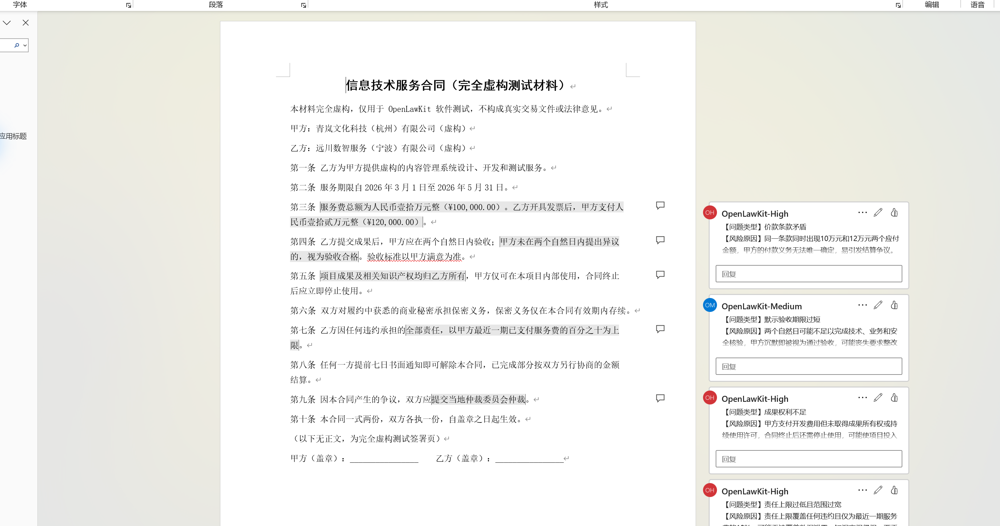
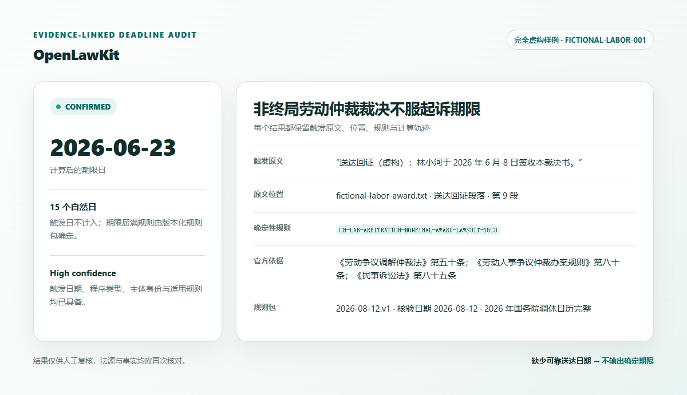
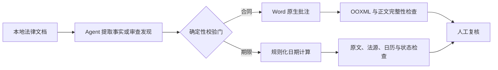

[English](README.md) | [简体中文](README.zh-CN.md)

# OpenLawKit

[](https://github.com/qwertyzhu/openlawkit/actions/workflows/ci.yml)
[](https://github.com/qwertyzhu/openlawkit/releases/latest)
[](LICENSE)
[](pyproject.toml)

**面向中国法律实务的本地优先 Agent Skills：在不改合同正文的前提下添加 Word 原生批注，只根据已核实的触发事实计算法律期限。**

项目服务于使用编程 Agent 的律师与法律 AI 开发者。OpenLawKit 刻意保持场景窄、过程可审计、结果可人工复核，不做万能法律聊天机器人。

[运行虚构样例](#运行仓库样例) · [下载合同批注 Skill](https://github.com/qwertyzhu/openlawkit/releases/latest/download/contract-comment-review.skill) · [下载期限提取 Skill](https://github.com/qwertyzhu/openlawkit/releases/latest/download/legal-deadline-extractor.skill) · [查看最新版本](https://github.com/qwertyzhu/openlawkit/releases/latest)

> **早期预览版：** 首个版本只覆盖两个中国法场景。它不替代律师，也不提供无人复核的法律意见。

## 先看真实输出

批注精确锚定合同原文，并以 Word 原生批注卡片呈现；下图合同完全虚构，正文保持不变。



期限结果保留触发原文、位置、规则、官方依据与计算状态。



两张图都来自仓库中的虚构样例。CI 会在 Linux、macOS 与 Windows 上复现确定性流程与完整性校验。

## 安装 Skills

### Codex

把下面内容粘贴到 Codex：

```text
$skill-installer
Install both skills from qwertyzhu/openlawkit:
- skills/contract-comment-review
- skills/legal-deadline-extractor
```

这符合 [Codex 官方 Skill 安装方式](https://learn.chatgpt.com/docs/build-skills)。安装后重启 Codex，让它重新发现 Skills。

### Claude Code

个人使用时，把 `skills/` 下两个目录复制到 `~/.claude/skills/`；仅供单个项目使用时，复制到项目的 `.claude/skills/`。这是 [Anthropic Agent Skills 官方文档](https://platform.claude.com/docs/en/agents-and-tools/agent-skills/overview)规定的文件目录。

`.skill` 包含说明、脚本、schema 和参考资料，但不捆绑 Python。确定性脚本需要 Python 3.10+、`lxml` 和 `python-docx`。下面的仓库样例会用项目配置安装这些依赖。

Release 文件：[contract-comment-review.skill](https://github.com/qwertyzhu/openlawkit/releases/latest/download/contract-comment-review.skill) · [legal-deadline-extractor.skill](https://github.com/qwertyzhu/openlawkit/releases/latest/download/legal-deadline-extractor.skill) · [SHA256SUMS.txt](https://github.com/qwertyzhu/openlawkit/releases/latest/download/SHA256SUMS.txt)。每次打版本标签都会重建这些归档；请用同一 Release 里的 `SHA256SUMS.txt` 校验。

## 运行仓库样例

最短的跨平台路径：

```console
git clone https://github.com/qwertyzhu/openlawkit.git
cd openlawkit
python -m pip install -e .
python scripts/run_demo.py --clean
```

预期产物：

- `demo-output/reviewed.docx`：对虚构合同添加 Word 原生批注；
- `demo-output/contract-verification.json`：批注结构和正文完整性校验；
- `demo-output/deadlines/`：JSON、Markdown 与 ICS 三种期限结果；
- 劳动仲裁虚构样例会根据明确的虚构送达记录，生成状态为 `confirmed` 的 `2026-06-23`。

这组命令复现已经人工确认的 findings/facts。Agent 如何从原始材料生成这些中间文件，见两个 `SKILL.md`。

## 两个聚焦工作流

| Skill | 输入 | 输出 | 核心验收条件 |
|---|---|---|---|
| [`contract-comment-review`](skills/contract-comment-review/SKILL.md) | `.docx` 合同和代表立场 | 带 Word 原生批注的 `.docx` 与问题清单 | 不静默改动合同正文文字 |
| [`legal-deadline-extractor`](skills/legal-deadline-extractor/SKILL.md) | 法律文书或提取后的事实 | 带原文、规则和状态的期限表 | 没有可靠触发事实和规则时不输出确定期限 |

可直接使用的提示词：

```text
请从买方立场审查这份 Word 合同。只添加 Word 原生批注，不修改正文，并返回完整性校验报告。
```

```text
请从这份文书提取可审计的法律期限，保留每个触发事实的原文和位置。缺少送达日期或程序类型时，输出 needs_confirmation，不要猜测。
```

## 为什么结果可以审计



- 除非用户明确选择，否则材料留在本地；
- 每个期限都保留触发原文和来源位置；
- 缺失事实成为待核验项，不会被编造补齐；
- 法律规则进入带版本、官方法源和核验日期的数据包；
- 虚构样例与回归测试让失败可以复现。

信任边界和校验门详见 [架构说明](docs/architecture.md)。

## 兼容性与限制

| 范围 | 当前支持情况 |
|---|---|
| 运行环境 | Python 3.10+；CI 使用 Python 3.10–3.12 覆盖 Ubuntu、Windows 与 macOS |
| Word 审查 | `.docx` 正文段落锚点；已在 Windows 版 Microsoft Word 中目视打开验收 |
| 暂不支持的 Word 批注锚点 | 表格、页眉页脚、文本框、超链接/域、修订容器和重叠锚点，v0.1 会主动拒绝；正文表格中的文字仍纳入完整性校验 |
| 期限规则 | v0.1 中国劳动仲裁与民事执行规则包中明确列出的事件 |
| 日历 | 仓库内已核实的 2026 年国务院放假调休表；其他年份须另行提供已核实日历 |
| 法律判断 | 始终需要人工复核；结构校验通过不等于法律意见正确 |

期限规则的具体纳入项、排除项与官方法源，见 [v0.1 期限规则范围](docs/rule-scope.zh-CN.md)。

## 路线图与社区

下一阶段最有价值的工作，是扩大真实结构的虚构回归样例、持续验证跨平台上手流程、建立安全的规则贡献方式，并在不削弱正文完整性校验的前提下支持更多 Word 结构。

- 使用问题、想法和安全演示请发到 [Discussions](https://github.com/qwertyzhu/openlawkit/discussions)；
- 从 [`good first issue`](https://github.com/qwertyzhu/openlawkit/labels/good%20first%20issue) 选择边界清楚的贡献；
- 提交规则或工作流前，请先阅读 [CONTRIBUTING.md](CONTRIBUTING.md)。

## 安全

不要在公开 Issue 中提交客户姓名、案号、账号口令、内部路径或真实在办案件材料。安全漏洞或意外泄露请使用 [GitHub 私密漏洞报告](https://github.com/qwertyzhu/openlawkit/security/advisories/new)。详见 [SECURITY.md](SECURITY.md)。

## 许可证

Apache License 2.0。详见 [LICENSE](LICENSE) 与 [NOTICE](NOTICE)。
